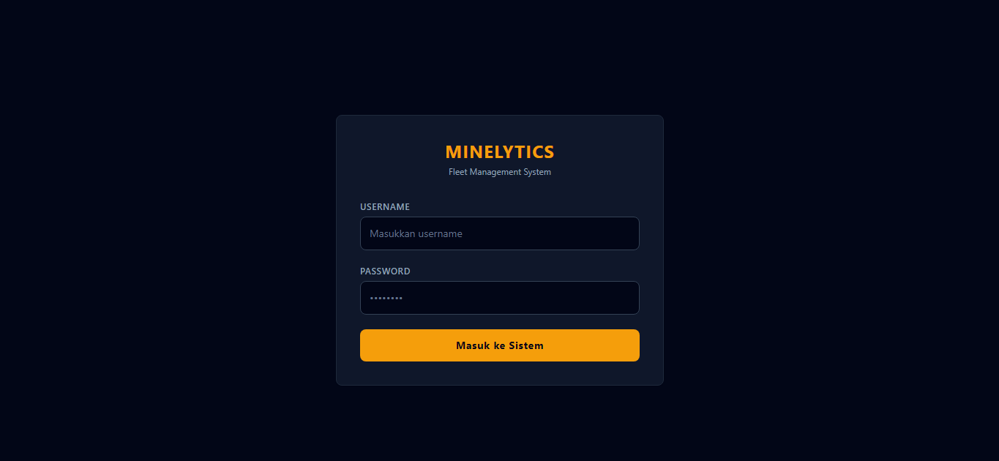
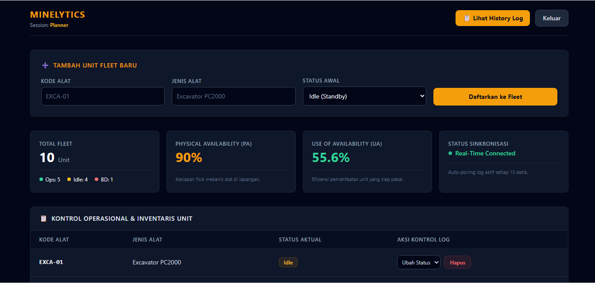
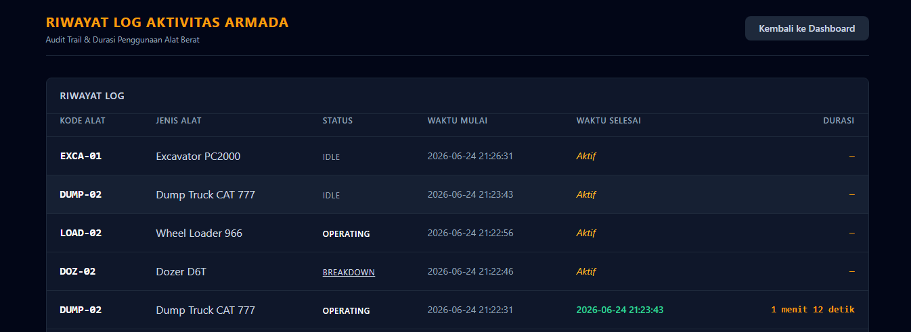

# MINELYTICS — Enterprise Fleet Management System

<div align="center">

**Dashboard real-time untuk monitoring & manajemen armada alat berat tambang.**

[](https://gibranee04.github.io/minelytics/)
[](https://gibrane.pythonanywhere.com/api/dashboard/metrics)
[](https://python.org)
[](https://flask.palletsprojects.com/)
[](https://vuejs.org/)
[](https://tailwindcss.com/)

</div>

---

## 📋 Daftar Isi

- [Tentang Proyek](#-tentang-proyek)
- [Arsitektur Sistem](#-arsitektur-sistem)
- [Fitur Utama](#-fitur-utama)
- [Tech Stack](#-tech-stack)
- [Struktur Proyek](#-struktur-proyek)
- [API Endpoints](#-api-endpoints)
- [Instalasi & Setup Lokal](#-instalasi--setup-lokal)
- [Deploy ke Production](#-deploy-ke-production)
- [Role-Based Access Control](#-role-based-access-control)
- [Screenshots](#-screenshots)
- [License](#-license)

---

## 🏗️ Tentang Proyek

**Minelytics** (Mining + Analytics) adalah aplikasi web **Enterprise Fleet Management** yang dirancang untuk industri pertambangan. Aplikasi ini menyediakan dashboard real-time untuk memonitor status, ketersediaan, dan riwayat operasional seluruh unit alat berat.

### Kalkulasi KPI Tambang

| Metrik | Rumus | Deskripsi |
|--------|-------|-----------|
| **PA** (Physical Availability) | `((Operating + Idle) / Total) × 100` | Kesiapan fisik mekanis alat di lapangan |
| **UA** (Use of Availability) | `(Operating / (Operating + Idle)) × 100` | Efisiensi pemanfaatan unit yang siap pakai |

---

## 🏭 Arsitektur Sistem

```
┌──────────────────────────────────────────────────────┐
│                    BROWSER (CLIENT)                   │
│         HTML + Vue.js 3 + Tailwind CSS               │
│    login.html → dashboard.html → history.html        │
└────────────────────┬─────────────────────────────────┘
                     │ REST API (JSON)
                     ▼
┌──────────────────────────────────────────────────────┐
│              FLASK BACKEND (SERVER)                   │
│         app.py — Gunicorn WSGI Server                │
│    /api/login | /api/fleet | /api/history            │
└────────────────────┬─────────────────────────────────┘
                     │ SQL Queries
                     ▼
┌──────────────────────────────────────────────────────┐
│                  DATABASE                             │
│         SQLite (production) / MySQL (local)          │
│    users | alat_berat | log_aktivitas                │
└──────────────────────────────────────────────────────┘
```

**Arsitektur Decoupled** — Frontend dan Backend di-deploy secara terpisah, terhubung melalui REST API.

---

## ✅ Fitur Utama

### 🔐 Autentikasi & Otorisasi (RBAC)
- Login dengan role **Planner** (Admin) dan **Viewer**
- Role-Based Access Control — setiap menu hanya muncul sesuai hak akses

### 📊 Dashboard Metrics
- Total Fleet, Operating, Idle, Breakdown
- Kalkulasi **Physical Availability (PA)**
- Kalkulasi **Use of Availability (UA)**
- Status sinkronisasi real-time (auto-polling 15 detik)

### 🚛 Manajemen Armada (CRUD)
- **Tambah** unit fleet baru
- **Ubah** status unit (Operating / Idle / Breakdown)
- **Hapus** unit beserta seluruh riwayat log
- Otomatis mencatat setiap perubahan status ke tabel log

### 📋 Riwayat Log Aktivitas
- Menampilkan seluruh history perubahan status unit
- Format durasi human-readable:
  - `< 1 menit` → "45 detik"
  - `1–59 menit` → "2 menit 16 detik"
  - `≥ 1 jam` → "1.5 jam"
- Status aktif ditandai dengan label "Aktif"

### 🎨 Desain UI
- **Brand Identity Minelytics** — slate dark theme dengan amber accent
- Fully responsive (mobile, tablet, desktop)
- Tailwind CSS utility-first styling
- Component-based Vue.js architecture

---

## 🛠️ Tech Stack

### Frontend
| Teknologi | Versi | Kegunaan |
|-----------|-------|----------|
| HTML5 | - | Struktur halaman |
| Vue.js | 3 (CDN) | Reactive UI & State Management |
| Tailwind CSS | 3 (CDN) | Utility-First Styling |

### Backend
| Teknologi | Versi | Kegunaan |
|-----------|-------|----------|
| Python | 3.x | Bahasa pemrograman |
| Flask | 3.0 | Web Framework |
| Flask-CORS | 4.0 | Cross-Origin Resource Sharing |
| Gunicorn | 21.2 | Production WSGI Server |
| SQLite | - | Database (production) |

### Deployment
| Platform | Layer | URL |
|----------|-------|-----|
| GitHub Pages | Frontend | [gibranee04.github.io/minelytics](https://gibranee04.github.io/minelytics/) |
| PythonAnywhere | Backend API | [gibrane.pythonanywhere.com](https://gibrane.pythonanywhere.com/api/dashboard/metrics) |

---

## 📁 Struktur Proyek

```
minelytics/
├── frontend/
│   ├── index.html          # Redirect ke login.html
│   ├── login.html           # Halaman login
│   ├── dashboard.html       # Dashboard utama
│   └── history.html         # Riwayat log aktivitas
├── backend/
│   ├── app.py               # Flask API (all endpoints)
│   ├── requirements.txt     # Python dependencies
│   ├── Procfile             # Render deployment config
│   └── render.yaml          # Render service definition
├── .github/
│   └── workflows/
│       └── deploy.yml       # GitHub Actions (GitHub Pages)
├── .gitignore               # Git ignore rules
├── design.md                # Design system documentation
└── README.md                # Dokumentasi proyek
```

---

## 🌐 API Endpoints

| Method | Endpoint | Deskripsi | Request Body |
|--------|----------|-----------|--------------|
| `POST` | `/api/login` | Autentikasi user | `{ "username", "password" }` |
| `GET` | `/api/dashboard/metrics` | Ambil metrics PA & UA | - |
| `GET` | `/api/fleet` | Ambil semua unit armada | - |
| `POST` | `/api/fleet` | Tambah unit baru | `{ "kode_alat", "jenis_alat", "status" }` |
| `PUT` | `/api/fleet/<id>/status` | Update status unit | `{ "status" }` |
| `DELETE` | `/api/fleet/<id>` | Hapus unit | - |
| `GET` | `/api/history` | Ambil riwayat log | `?start_date=&end_date=` |

### Contoh Response — Dashboard Metrics

```json
{
  "metrics": {
    "total_alat": 10,
    "unit_operating": 5,
    "unit_idle": 3,
    "unit_breakdown": 2,
    "pa": 80.0,
    "ua": 62.5
  }
}
```

---

## ⚙️ Instalasi & Setup Lokal

### Prasyarat
- Python 3.10+
- pip
- MySQL (opsional — untuk mode MySQL lokal)

### Langkah Setup

```bash
# 1. Clone repository
git clone https://github.com/gibranee04/minelytics.git
cd minelytics

# 2. Install dependencies
cd backend
pip install -r requirements.txt
pip install flask-cors

# 3. Jalankan backend (SQLite mode - default)
python app.py

# 4. Buka frontend di browser
# Buka file: frontend/login.html
```

### Akses Lokal
| Halaman | URL |
|---------|-----|
| Login | `http://localhost:5000` via frontend |
| Dashboard | `http://localhost:5000` via frontend |
| API Metrics | `http://localhost:5000/api/dashboard/metrics` |
| API Fleet | `http://localhost:5000/api/fleet` |

---

## 🚀 Deploy ke Production

### Backend (PythonAnywhere)

1. Daftar & login di [pythonanywhere.com](https://pythonanywhere.com)
2. Buka **Bash Console**:
   ```bash
   mkdir minelytics && cd minelytics
   pip install --user flask==3.0.0 flask-cors==4.0.0 gunicorn==21.2.0
   ```
3. Upload `app.py` via tab **Files** → `/home/USERNAME/minelytics/`
4. Tab **Web** → **Add a new web app** → **Flask** → **Python 3.10**
5. Edit **WSGI configuration file**:
   ```python
   import sys, os
   path = '/home/USERNAME/minelytics'
   if path not in sys.path:
       sys.path.insert(0, path)
   os.environ['USE_SQLITE'] = 'true'
   from app import app as application
   ```
6. Klik **Reload** → Test: `https://USERNAME.pythonanywhere.com/api/dashboard/metrics`

### Frontend (GitHub Pages)

1. Push code ke GitHub
2. Repo → **Settings** → **Pages** → Source: **GitHub Actions**
3. Buat `.github/workflows/deploy.yml`:
   ```yaml
   name: Deploy to GitHub Pages
   on:
     push:
       branches: [main]
   permissions:
     contents: read
     pages: write
     id-token: write
   jobs:
     deploy:
       runs-on: ubuntu-latest
       environment:
         name: github-pages
         url: ${{ steps.deployment.outputs.page_url }}
       steps:
         - uses: actions/checkout@v4
         - name: Setup Pages
           uses: actions/configure-pages@v4
         - name: Upload artifact
           uses: actions/upload-pages-artifact@v3
           with:
             path: './frontend'
         - name: Deploy to GitHub Pages
           id: deployment
           uses: actions/deploy-pages@v4
   ```
4. Push → Buka tab **Actions** → Tunggu workflow selesai

---

## 🔑 Role-Based Access Control

| Fitur | Planner (Admin) | Viewer |
|-------|:---:|:---:|
| Melihat Dashboard | ✅ | ✅ |
| Melihat Riwayat Log | ✅ | ❌ |
| Menambah Unit Fleet | ✅ | ❌ |
| Mengubah Status Unit | ✅ | ❌ |
| Menghapus Unit | ✅ | ❌ |

### Default Credentials

| Role | Username | Password |
|------|----------|----------|
| **Planner** (Admin) | `admin` | `admin123` |
| **Viewer** | `viewer` | `viewer123` |

> ⚠️ **Catatan:** Untuk production, ubah password default dan implementasi JWT / token-based authentication.

---

## 📸 Screenshots

### Login Page


### Dashboard


### History Log

---

## 🤝 Kontribusi

```bash
# Fork repository
# Buat branch baru
git checkout -b feature/nama-fitur

# Commit perubahan
git commit -m "feat: tambah deskripsi fitur"

# Push ke branch
git push origin feature/nama-fitur

# Buka Pull Request
```

---

## 📄 License

MIT License — Silakan digunakan untuk portofolio dan pembelajaran.

---

<div align="center">

**Built with ❤️ for Mining Industry**

*Dikembangkan sebagai proyek portofolio — Enterprise Fleet Management System*

</div>
